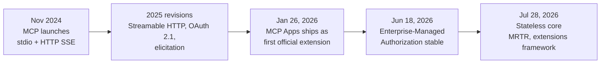
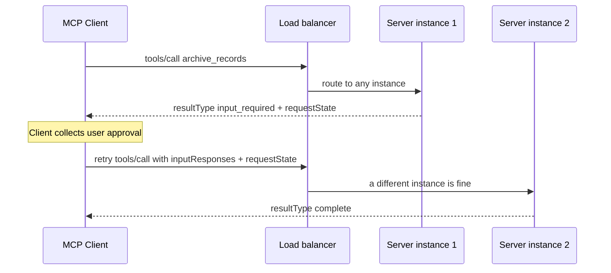
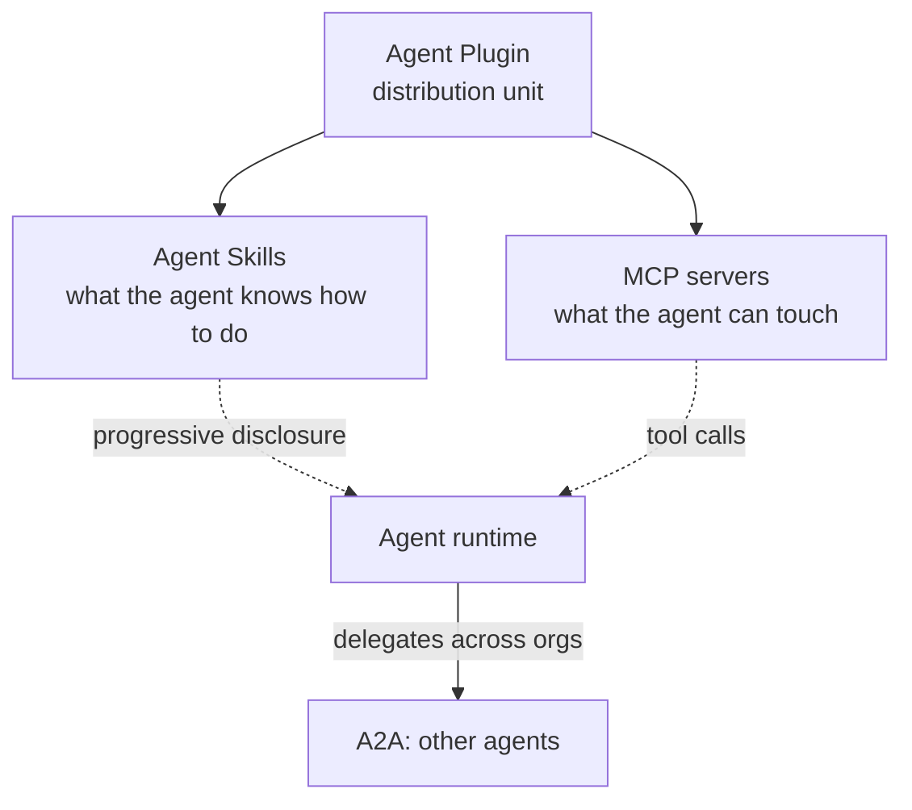
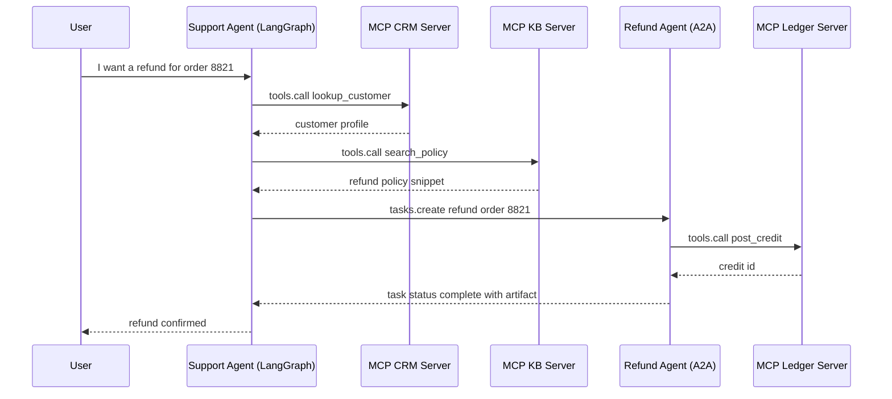
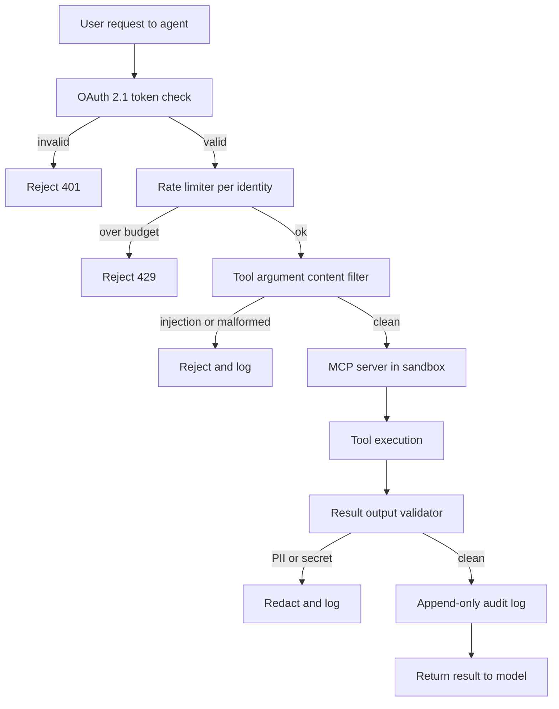

# Tool Use and MCP

Tools are the "hands" of an agent. The industry has standardized on the **Model Context Protocol (MCP)**, which replaces fragmented custom tool definitions with a unified, local-first communication layer. MCP has matured rapidly: Streamable HTTP transport, OAuth 2.1 auth, and native computer-use tools landed across the 2025 spec revisions (what much of the ecosystem loosely calls MCP 2.0), and the **2026-07-28 revision** rebuilt the protocol core as stateless, the largest overhaul since MCP launched (see [the stateless rewrite](#mcp-2026-07-28) below). In parallel, **Agent-to-Agent (A2A)** and other interoperability protocols have emerged to complement MCP's tool-access layer with agent coordination capabilities.

## Table of Contents

- [The Tool-Use Mechanism](#mechanism)
- [Model Context Protocol (MCP)](#mcp)
- [MCP 2.0: Streamable HTTP & Auth](#mcp-updates)
- [MCP 2026-07-28: The Stateless Rewrite](#mcp-2026-07-28)
- [MCP Extensions & Ecosystem (August 2026)](#mcp-roadmap)
- [Agent Plugins](#agent-plugins)
- [Agent-to-Agent Protocol (A2A)](#a2a)
- [The Protocol Landscape: MCP + A2A + ACP](#protocol-landscape)
- [Computer-Use Tools (Anthropic)](#computer-use)
- [Defining High-Precision Tools](#precision)
- [MCP vs. OpenAI Function Calling](#mcp-vs-openai)
- [Context7: Live Documentation MCP](#context7)
- [Streaming Tool Calls](#streaming)
- [Interview Questions](#interview-questions)
- [References](#references)

---

## The Tool-Use Mechanism

Tool use occurs in a 3-step cycle:
1. **Schema Presentation**: The model is given a JSON schema of the tools.
2. **Intent & Extraction**: The model outputs a "Call" (e.g., `{"tool": "get_weather", "args": {"city": "Tokyo"}}`).
3. **Execution & Contextualization**: The system runs the function and feeds the result back into the prompt.

**Nuance**: Production stacks no longer "hardcode" tool definitions into the system prompt. They use **Dynamic Manifests** that fetch only necessary tools based on the user's intent.

---

## Model Context Protocol (MCP)

Developed by Anthropic (released November 2024) and now the universal tool-integration standard across Anthropic, OpenAI, Google, Microsoft, and AWS, MCP allows models to interact with data and tools regardless of where they live. Governance moved to the Linux Foundation's Agentic AI Foundation in December 2025.

- **MCP Client**: The AI application (e.g., your agent code).
- **MCP Server**: A standalone process that exposes Tools (Functions), Resources (Data), and Prompts (Templates).
- **Communication**: Uses JSON-RPC over stdio or HTTP.

### Why MCP?
- **Security**: Tools run in their own process, not in the model logic.
- **Portability**: Write a "Postgres Tool" once, use it in Claude, GPT, or Llama.
- **Discoverability**: Standardized `list_tools` and `get_resource` commands.

---

## Defining High-Precision Tools

A production-quality tool must include:

1. **Strict Type Validation**: Use Pydantic or Zod to enforce schemas before the model even sees the call.
2. **Detailed Docstrings**: Describe *when NOT* to use the tool.
3. **Confidence Thresholds**: Require the model to output a `confidence` score for the tool call.

```python
# MCP Server Example (Conceptual)
@server.tool()
class ExecuteSQL(PydanticModel):
    """Executes a Read-Only SQL query. DO NOT use for DROP/DELETE."""
    query: str = Field(..., description="The SELECT query to run.")

    async def run(self):
        # Implementation here...
        pass
```

---

## MCP vs. OpenAI Function Calling

| Feature | OpenAI Native | MCP |
|---------|---------------|-----|
| **Coupling** | High (OpenAI specific) | Low (Agnostic) |
| **Transport** | JSON in API body | JSON-RPC (Local/Remote) |
| **Data Access**| No native data "Resource" | Native `Resources` support |
| **Best For** | Prototyping | Enterprise Orchestration |

---

## Streaming Tool Calls

Frontier models support **Partial Tool Speculation**.
Instead of waiting for the full JSON to generate, the system starts "prefetching" tool results as soon as the tool name and critical IDs are visible in the stream. This reduces perceived latency by **400-800ms**.

---

## MCP 2.0: Streamable HTTP & Auth

The MCP 2.0 specification (ratified March 2026) introduced two major changes:

### 1. Streamable HTTP Transport
Previous MCP used `stdio` or basic HTTP with SSE. MCP 2.0 adds **Streamable HTTP** - a single long-lived HTTP connection that handles bidirectional streaming:

```
[MCP Client] ←── Streamable HTTP POST /mcp ──→ [MCP Server]
                  (with SSE response stream)
```

- Enables MCP servers deployed as cloud microservices (not just local processes)
- Allows multiple simultaneous tool calls over one connection
- Backwards compatible with stdio transport

### 2. OAuth 2.1 Authorization
Remote MCP servers can now require proper auth:

```json
{
  "type": "oauth2",
  "grant_type": "client_credentials",
  "scopes": ["tools:read", "resources:documents"]
}
```

This enables enterprise MCP servers with fine-grained access control per tenant.

---

## MCP 2026-07-28: The Stateless Rewrite

On July 28, 2026 the MCP project finalized spec revision **2026-07-28**, the largest protocol overhaul since MCP launched, after a ten-week release-candidate freeze. The headline: **the protocol core is now stateless**. The `initialize` handshake and the `Mcp-Session-Id` header are gone; every request carries the protocol version and client capabilities in `_meta`, and servers identify themselves in result `_meta`. Cross-call state moves into explicit server-minted handles passed as ordinary tool arguments. The practical consequence is that a remote MCP server can now run as a horizontally scaled deployment behind a plain round-robin load balancer with zero shared session state, which previously required sticky sessions or a shared session store.

### How MCP Got Here



### Three Generations of MCP, Compared

| Dimension | Launch (Nov 2024) | Streamable HTTP era (2025 revisions) | 2026-07-28 revision |
|-----------|-------------------|--------------------------------------|---------------------|
| **Session model** | Stateful `initialize` handshake | Stateful, `Mcp-Session-Id` over Streamable HTTP | Stateless; version and capabilities ride in `_meta` on every request |
| **Transport** | stdio, HTTP+SSE | Adds Streamable HTTP | Streamable HTTP with mandatory `Mcp-Method` / `Mcp-Name` routing headers; HTTP+SSE formally deprecated |
| **Server-initiated requests** | Sampling, roots (server push) | Adds elicitation | Removed; replaced by Multi Round-Trip Requests (client retries with state) |
| **Mid-call user input** | None | `elicitation/create` push | `input_required` result + client retry with `requestState` |
| **Long-running work** | None | Experimental | Tasks official extension (poll-based handles) |
| **Server-rendered UI** | None | MCP Apps ships as an extension (Jan 2026) | MCP Apps folded into the formal extensions framework |
| **Auth** | None standardized | OAuth 2.1 + PKCE, Dynamic Client Registration | OAuth hardened: RFC 9207 `iss` validation, issuer-bound credentials, CIMD replaces DCR; EMA extension for enterprise IdPs |
| **List caching** | None | None | Required `ttlMs` + `cacheScope` on list and read results; deterministic tool ordering for prompt-cache hits |
| **Stream recovery** | None | SSE `Last-Event-ID` resumability | Removed; clients re-issue the request, durable work uses Tasks |
| **Horizontal scaling** | Single process | Sticky sessions behind a load balancer | Any instance serves any request; no shared state |

### Multi Round-Trip Requests (MRTR)

The server-initiated request pattern (`elicitation/create`, `sampling/createMessage`, `roots/list`) is removed. When a server needs mid-call user input, it returns a result with `resultType: "input_required"`, an `inputRequests` array, and an opaque `requestState` blob; the client collects the input and retries the original request with `inputResponses` attached. Because the state rides in the retry, any server instance behind the load balancer can resume the interrupted call. This is what makes human-in-the-loop approval gates compatible with stateless horizontal scaling.



All results now carry a required `resultType` field (`complete` or `input_required`; extensions such as Tasks add further values); results from older servers that lack it are treated as `complete`.

### What Is Deprecated or Removed

The revision also adopts a formal feature lifecycle (Active, Deprecated, Removed) with a minimum twelve-month deprecation window and a public deprecated-features registry. For features newly deprecated in this revision (Roots, Sampling, Logging, DCR) the earliest removal is July 28, 2027; HTTP+SSE, deprecated back in March 2025, runs on an earlier clock.

| Feature | Status in 2026-07-28 | Migrate to |
|---------|----------------------|------------|
| `initialize` handshake, `Mcp-Session-Id` | Removed | Version and capabilities in `_meta` per request; `server/discover` RPC for probing |
| `elicitation/create`, `sampling/createMessage`, `roots/list` | Removed | Multi Round-Trip Requests |
| SSE stream resumability (`Last-Event-ID`) | Removed | Re-issue the request; Tasks extension for durable work |
| Roots | Deprecated | Pass directories via tool parameters, resource URIs, or server config |
| Sampling | Deprecated | Call the LLM provider API directly |
| Logging | Deprecated | stderr (stdio) or OpenTelemetry |
| HTTP+SSE transport | Formally deprecated | Streamable HTTP |
| Dynamic Client Registration (RFC 7591) | Deprecated | Client ID Metadata Documents (client ID is a URL hosting the client's metadata) |

The RPC mechanisms (`elicitation/create`, `sampling/createMessage`, `roots/list`) are removed from the core protocol while the features they served are deprecated with migration paths, which is why both kinds of rows appear above.

Two smaller but design-relevant transport changes: `Mcp-Method` and `Mcp-Name` HTTP headers are now mandatory on Streamable HTTP POSTs, so load balancers, gateways, and WAFs can route and filter MCP traffic without parsing JSON-RPC bodies; and list results (`tools/list`, `prompts/list`, `resources/list`) must declare `ttlMs` and `cacheScope`, giving clients a principled answer to caching tool catalogs.

### The Extensions Framework

The core is now deliberately small; everything else is an **extension**, identified by reverse-DNS ID, versioned independently of the core spec, and governed through an Extensions Track in the SEP process. The official extensions include:

| Extension | Status | What it does |
|-----------|--------|--------------|
| **Tasks** (`io.modelcontextprotocol/tasks`) | Official; redesigned poll-based lifecycle, contributed by AWS | A tool call can answer with a task handle; the client polls `tasks/get`, pushes mid-task input with `tasks/update`, cancels with `tasks/cancel`. The standard answer for work that outlives a request. |
| **MCP Apps** | Official since January 26, 2026 | A tool declares a `ui://` template; the host renders it in a sandboxed iframe (no DOM access, deny-by-default CSP), UI-to-host communication is postMessage-carried JSON-RPC, and UI-triggered actions go through the same tool-call consent path. Rendered by Claude, ChatGPT, VS Code, Goose, and Microsoft 365 Copilot, among others. |
| **Enterprise-Managed Authorization (EMA)** | Stable since June 18, 2026 | An organization provisions MCP server access centrally through its IdP: an OIDC or SAML assertion is exchanged (RFC 8693) for an ID-JAG, which a JWT bearer grant (RFC 7523) trades for an MCP access token, with no per-user consent screens. Okta is the first supported IdP; Claude and VS Code shipped support at launch. |

### Migration Checklist

- Remove `initialize` / session-ID logic; send version and capabilities in `_meta`, and implement the `server/discover` RPC (now a MUST).
- Convert elicitation and sampling flows to MRTR: return `input_required` with `requestState`, accept retries with `inputResponses`.
- Move any cross-call state into explicit handles passed as tool arguments, or adopt the Tasks extension.
- Emit `Mcp-Method` / `Mcp-Name` headers, declare `ttlMs` / `cacheScope` on list results, and return tools in deterministic order.
- Plan the auth migration from DCR to Client ID Metadata Documents; validate `iss` per RFC 9207 and never reuse client credentials across issuers.
- Budget real work: the maintainers themselves warn that custom implementations face significant uplift.

> *Verified August 15, 2026. Sources: modelcontextprotocol.io/specification/2026-07-28/changelog, blog.modelcontextprotocol.io*

---

## MCP Extensions & Ecosystem (August 2026)

The roadmap items this chapter tracked through May 2026 have largely shipped. Status as of August 2026:

| Roadmap item (May 2026 framing) | Status (August 2026) |
|---------------------------------|--------------------|
| Transport scalability / stateless core | **Shipped** in the 2026-07-28 revision (see [the stateless rewrite](#mcp-2026-07-28)) |
| MCP Apps (server-rendered UIs) | **Shipped** January 26, 2026 as the first official extension; rendered by Claude, ChatGPT, VS Code, Goose, and Microsoft 365 Copilot, among others; early apps-shipping partners include Figma, monday.com, and Adobe Express |
| Tasks extension (long-running work) | **Shipped.** The 2026-07-28 revision moved Tasks out of the experimental core into the `io.modelcontextprotocol/tasks` extension, redesigned around poll-based task handles. The reference repository is still labeled experimental, so treat the interface as settling rather than settled. The Agents Working Group (active since February 2026, charter still pending) is the group incubating it |
| Enterprise authentication | **Shipped** June 18, 2026 as the Enterprise-Managed Authorization extension (Okta first IdP; Claude and VS Code at launch) |
| MCP Server Cards (`.well-known` discovery) | Still a draft, developed as an experimental extension (SEP-2127). Distinct from the new core `server/discover` RPC, which is an in-protocol capability query |
| MCP Registry | Still in preview (`registry.modelcontextprotocol.io`); GA timing unannounced. Release v1.8.1 fixed a GitHub Pages organization-namespace takeover |

**Discovery now has two layers worth keeping straight:** pre-connection HTTP discovery via `.well-known` server cards (experimental; feeds registries and crawlers) versus the in-protocol `server/discover` RPC (mandatory core since 2026-07-28; feeds version negotiation).

**Ecosystem scale (August 2026):** SDK downloads run in the hundreds of millions per month. The protocol's own July 28 release post cited close to half a billion monthly across Tier 1 SDKs; Anthropic separately reported 400M monthly and a 4x increase across the year, so treat the aggregate as an order of magnitude rather than a precise figure and check the metric definition before quoting it. One connector directory alone now lists **over 950 MCP servers**. At the July 28 final release AWS, Cloudflare, Google Cloud, Microsoft, and Netlify announced launch support.

**But the migration to the stateless revision is early.** Measured over the 30 days to August 14, the v1 TypeScript SDK (`@modelcontextprotocol/sdk`) drew roughly 200M npm downloads. The v2 line is split across packages rather than one, with `@modelcontextprotocol/server` around 5.3M, `@modelcontextprotocol/core` around 3.9M, and `@modelcontextprotocol/client` around 2.9M, so on any single-package comparison v2 is running in the low single-digit percentage of v1 volume a few weeks after GA. Plan for a long dual-version period: the C# SDK v2.2.0 (August 13) added an `HttpServerSessionMode` that lets a single endpoint serve both 2025-11-25 stateful clients and 2026-07-28 stateless clients at once, which is the pattern to copy if you operate a server fleet with mixed clients. SDK maturity is moving quickly alongside it: the Rust SDK reached 3.1.x with stateless validation, the Ruby SDK hit 1.0 and moved to Tier 2, and a conformance suite (0.2.0-alpha.11) now publishes frozen requirement sets for the revision. Microsoft rolled out MCP-based Federated Copilot Connectors manageable from the Microsoft 365 admin center, Apple made Xcode an MCP host for external coding agents, and Bloomberg has published a production case study of MCP as its internal agent-tool layer.

**Governance**: MCP is governed under the Linux Foundation's Agentic AI Foundation. The Governance Working Group runs a Contributor Ladder and a delegation model allowing domain-specific working groups to accept SEPs (Specification Enhancement Proposals) without full core-maintainer review; the 2026-07-28 revision added a formal Extensions Track.

> *Verified August 15, 2026. Sources: modelcontextprotocol.io, blog.modelcontextprotocol.io*

---

## Agent Plugins

MCP standardizes how an agent reaches a tool. **Agent Plugins**, which reached 1.0.0 on August 6, 2026, standardizes how you *ship* a bundle of capability to an agent. It is a vendor-neutral packaging format governed by a technical steering committee whose launch maintainers were Amazon, Cursor, Microsoft, OpenAI, and Vercel, with Google joining on launch day, and GitHub made it generally available across VS Code, Copilot CLI, the Copilot SDK, and the Copilot app on August 12.

A plugin is a directory:

```
my-plugin/
├── plugin.json          # required manifest
├── skills/              # optional: Agent Skills (SKILL.md files)
│   └── code-review/
│       └── SKILL.md
├── mcp.json             # optional: MCP server declarations
└── com.example.client/  # optional: client-specific extras, namespaced
```

The `mcp.json` schema supports three server shapes (stdio with command, args, and env; Streamable HTTP; and SSE), and reserves two environment variables, `PLUGIN_ROOT` and `PLUGIN_DATA`, that the client injects at load time.

The design decision worth studying is what the spec **refuses** to standardize. Only two component types are portable: skills and MCP servers. Commands, hooks, subagents, rules, and LSP servers stay client-specific unless carried in a namespaced directory. That keeps the portable surface small enough that a plugin genuinely runs everywhere, and pushes the fast-moving, client-specific parts into namespaces where they cannot break interoperability.

### How the Three Layers Fit



| Layer | Standardizes | Unit | Governance |
|-------|--------------|------|------------|
| **Agent Skills** (`SKILL.md`) | Procedures and domain knowledge the agent applies | A folder with frontmatter plus optional scripts and assets | agentskills.io |
| **MCP** | Access to tools, data, and resources | A server speaking JSON-RPC over stdio or Streamable HTTP | Linux Foundation, Agentic AI Foundation |
| **Agent Plugins** | Distribution and installation of the two above | A directory with `plugin.json` | Agent Plugins TSC |
| **A2A** | Delegation between agents across vendor or org boundaries | An agent endpoint with a signed Agent Card | Linux Foundation |

The practical consequence for platform teams: enterprise administration now has one control point. GitHub reuses the existing `managed-settings.json` so plugin installation, marketplace access, and MCP server allowlists are all managed through the same file. If you are standing up an internal agent platform, the plugin is the unit you review, sign, and distribute, not the individual server.

**The security caveat that comes with it:** a plugin bundles instructions (skills) with capability (MCP servers), so installing one is closer to installing a package than adding a bookmark. Static analysis of skills has a hard detection ceiling, with published results showing 93% detection for data exfiltration but only 42% for natural-language prompt injection and **0% for host destruction**, because destructive skills use ordinary shell commands that look identical to legitimate ones. Review plugins like dependencies: pin versions, prefer signed sources, and never let a plugin widen the action surface of the agent that loads it.

---

## Agent-to-Agent Protocol (A2A)

Google introduced the **Agent2Agent (A2A)** protocol in April 2025 to solve a problem MCP does not address: how do **agents from different vendors** communicate with each other (not just with tools)?

### What A2A Solves

MCP defines how an agent connects to **tools and data**. A2A defines how an **orchestrator agent delegates tasks to a specialist agent** from a different vendor or framework, even when they do not share memory, tools, or context.

### Technical Foundation

- Built on **HTTP, SSE, and JSON-RPC** (same foundation as MCP, for easy integration)
- Supports enterprise-grade authentication with parity to OpenAPI auth schemes
- **Agent Cards**: JSON metadata documents that describe an agent's capabilities, skills, and endpoint - analogous to MCP Server Cards but for agents

### A2A Task Lifecycle

```
[Client Agent] ── POST /tasks ──→ [Remote Agent]
                                     │
                  ← SSE stream ──────┘  (status updates, artifacts)
                                     │
                  ← Task Complete ───┘  (final result)
```

A2A tasks support long-running operations with streaming status updates, making it suitable for enterprise workflows spanning minutes or hours.

### Industry Adoption

- Backed by 50+ technology partners including Atlassian, Salesforce, SAP, LangChain, and PayPal
- Donated to the **Linux Foundation** in June 2025 as an open governance project
- **Version 0.3** added gRPC support, signed security cards, and extended Python SDK support. As of August 2026 the newest A2A **specification** release is **v1.0.1** (May 28, 2026); version numbers above that circulating in the ecosystem refer to language SDKs, such as `a2a-java` v1.2.0, not to the protocol
- NIST launched an "AI Agent Standards Initiative" in February 2026 partly in response to A2A/MCP momentum

> *Verified May 2026. Source: developers.googleblog.com, a2a-protocol.org*

---

## The Protocol Landscape: MCP + A2A + ACP

In production enterprise systems, multiple protocols operate at different layers simultaneously:

| Protocol | Layer | Purpose | Governed By |
|----------|-------|---------|-------------|
| **MCP** | Agent-to-Tool | Universal tool and data access | Linux Foundation (Agentic AI Foundation) |
| **A2A** | Agent-to-Agent | Cross-vendor agent delegation | Linux Foundation |
| **ACP** | Agent Communication | Lightweight async agent messaging (REST) | IBM / Linux Foundation |

### How They Complement Each Other

```
┌──────────────────────────────────────────┐
│            Enterprise System             │
│                                          │
│  ┌─────────┐  A2A   ┌─────────┐         │
│  │ Agent A  │◄──────►│ Agent B │         │
│  │(Vendor X)│        │(Vendor Y)│        │
│  └────┬─────┘        └────┬─────┘        │
│       │ MCP                │ MCP          │
│  ┌────▼─────┐        ┌────▼─────┐        │
│  │ DB Tool  │        │ API Tool │        │
│  │ Server   │        │ Server   │        │
│  └──────────┘        └──────────┘        │
└──────────────────────────────────────────┘
```

**Key insight**: MCP and A2A are complementary, not competing. MCP handles agent-to-tool connections; A2A handles agent-to-agent coordination. Production systems use both.

**ACP note**: The IBM-originated Agent Communication Protocol (ACP) team merged efforts with the Google A2A team in September 2025 to develop a unified agent communication standard. New projects should target A2A as the primary agent-to-agent protocol.

---

## A2A v1.0 GA and the May 2026 MCP Production Story

A2A v1.0 reached general availability at Google Cloud Next 2026 (April) with public commitments from 150+ organizations including AWS, Microsoft, Salesforce, SAP, ServiceNow, Workday, and IBM. The project moved under the Linux Foundation's Agentic AI Foundation, which now governs A2A alongside the merged ACP work. A point release (v1.2) added cryptographically signed Agent Cards: cards are signed JWS documents tied to the agent operator's public key, so a client agent can verify that a remote agent at `https://refunds.acme.com/.well-known/agent.json` actually belongs to ACME before issuing a task. Native A2A client/server support shipped in Google ADK 1.0, LangGraph, CrewAI, LlamaIndex, Semantic Kernel, and AutoGen.

### Composition Pattern: Support Agent Delegating Refunds

A LangGraph customer-support agent owns conversation state and a set of MCP tools (CRM, ticket search, knowledge base). When the user asks for a refund, that work belongs to a different team's Finance refund agent, which lives behind an A2A endpoint and enforces its own policy, audit log, and SOX controls. The support agent does not call the refund database directly; it issues an A2A task and lets the Finance agent decide.



The Support agent never sees the ledger. The Refund agent owns ledger access through its own MCP server and enforces a different policy. The A2A task is asynchronous: the Support agent can yield to the user with a hold message while the refund processes and reattach when the artifact arrives.

### MCP 2026 Roadmap Highlights: Both Shipped

The two roadmap items this section tracked in mid-2026, transport scalability and enterprise-managed auth, have both landed. Transport scalability arrived not as session resumption but as the opposite design: the 2026-07-28 revision removed sessions from the protocol core entirely (see [the stateless rewrite](#mcp-2026-07-28)). Enterprise-managed auth shipped as the Enterprise-Managed Authorization extension in June 2026. The RFC 8707 posture still holds and is now hardened further: MCP servers are OAuth Resource Servers, tokens are audience-bound to a specific server URI and cannot be replayed across servers.

### MCP Production Hardening (post-May-2026)

May 2026 surfaced a class of vulnerability in the MCP STDIO transport: STDIO MCP servers had implicitly assumed that the process boundary was the trust boundary, but a crafted tool argument from an upstream model could trick a poorly written STDIO server into invoking host commands with the host user's privileges. The architectural fix is two-step:

1. **Migrate STDIO MCP servers to HTTP transport with TLS** wherever possible. HTTP transport forces an explicit trust boundary (the network) and enables OAuth 2.1 Resource Server enforcement, which STDIO cannot provide.
2. **For STDIO servers that cannot migrate**, run each server in a dedicated container with no host filesystem mounts, no network egress, a strict CPU and memory budget, and a read-only image. Treat the container as the trust boundary; the blast radius of compromise is the container.

### State-Handle Hijacking: The Stateless Core's New Attack Surface

The 2026-07-28 stateless rewrite removed protocol-level sessions, so a server that needs cross-request state now mints an explicit handle (a cart ID, a workflow ID) and returns it as an ordinary tool argument. The revised security best-practices document names the resulting attack: **state-handle hijacking**, where an unauthorized party obtains or guesses a handle and uses it to read or modify another user's state.

The requirements follow directly, and they are worth memorizing because the failure mode is silent:

- A server implementing authorization **must verify every inbound request** and **must not treat possession of a state handle as authentication**. A handle is a name, not a credential.
- Handles **should be non-deterministic**, drawn from a secure random number generator.
- Handles **should be bound server-side to the authenticated user**, for example by keying state as `<user_id>:<handle>` where the user ID derives from the verified token rather than from anything the client sends.

The reason this matters more than it sounds: in the stateful era the session itself carried identity, so a sloppy server accidentally got some isolation for free. Statelessly, nothing is free. Every request must re-establish who is asking before the handle means anything.

**How bad is the field today?** The first large-scale dynamic audit of internet-facing MCP servers (arXiv 2608.00150, July 31, 2026) discovered over 21,000 publicly reachable instances, confirmed 640 as production, and dynamically tested 414 of them. It found **91.8% had no OAuth authentication at all**, and 687 tool instances exposed uncontrolled shell execution. Treat any MCP server reachable from the public internet as needing an authorization review before it needs a feature.

**Defense-in-Depth Checklist for Production MCP:**

- All remote MCP servers run behind OAuth 2.1 with PKCE and audience-bound tokens (RFC 8707).
- STDIO servers run inside a container with `network: none`, read-only root filesystem, no host volume mounts, and a `nproc` and `memory` cap.
- Every tool invocation is logged with user identity, bound token audience, tool name, argument hash, and result hash. Logs ship to an append-only store.
- A rate limiter sits in front of every MCP server, scoped by user identity. Burst budgets are tight for write-capable tools.
- Tool arguments pass through a content filter before reaching the server: pattern-based prompt-injection detection on string fields, schema validation on structured fields, hard rejection for shell metacharacters in tools that do not need them.
- Tool results pass through an output validator before being fed back to the model: PII detection, secret detection, size cap, content filter for known exfiltration markers.
- Dangerous tools (file write, shell execution, outbound HTTP) require a human approval step or a signed capability token rather than relying on the model to call them safely.

Request flow with all defensive layers:



The pipeline is deliberately conservative. Every layer can reject; only the result that survives all five gates reaches the model.

**Sources for this section:**
- [Google Cloud A2A v1.0 GA at Cloud Next 2026](https://cloud.google.com/blog/products/ai-machine-learning/agent2agent-protocol-is-getting-an-upgrade)
- [MCP 2026 Roadmap (The New Stack)](https://thenewstack.io/model-context-protocol-roadmap-2026/)
- [RFC 8707: Resource Indicators for OAuth 2.0](https://www.rfc-editor.org/rfc/rfc8707)
- [Adversa AI: Top MCP Security Resources May 2026](https://adversa.ai/blog/top-mcp-security-resources-may-2026/)
- [Anthropic Constitutional Classifiers](https://www.anthropic.com/research/constitutional-classifiers)

---

## Computer-Use Tools (Anthropic)

Claude 3.5+ introduced native **computer-use** tools - the model can directly control a desktop or web browser. These are available via the Anthropic API:

| Tool | Capability | Notes |
|------|------------|-------|
| `bash` | Run shell commands | Persistent session across turns |
| `text_editor` | Read/write/edit files | Supports view, create, str_replace commands |
| `computer` | Mouse, keyboard, screenshot | Full desktop GUI control |

```python
import anthropic

client = anthropic.Anthropic()

response = client.beta.messages.create(
    model="claude-3-7-sonnet-20250219",
    max_tokens=4096,
    tools=[
        {"type": "bash_20250124", "name": "bash"},
        {"type": "text_editor_20250124", "name": "str_replace_based_edit_tool"},
        {"type": "computer_20251022", "name": "computer",
         "display_width_px": 1280, "display_height_px": 800}
    ],
    messages=[{"role": "user", "content": "Open Firefox, go to GitHub, and clone my repo."}],
    betas=["computer-use-2024-10-22", "interleaved-thinking-2025-05-14"]
)
```

**Production safety rules for computer-use:**
1. Always run in a sandboxed VM (Docker + VNC, or E2B cloud)
2. Screenshot-validate critical state before destructive actions
3. Use HITL (Human-in-the-Loop) for irreversible actions (file deletion, form submission)
4. Set `ANTHROPIC_MAX_COMPUTER_TOKENS` to cap runaway loops

---

## Context7: Live Documentation MCP

One of the most practical MCP servers in 2026 is **Context7** - it resolves the "stale training data" problem for coding agents:

```
# Without Context7:
Agent: "I'll use langchain's `create_openai_tools_agent` function..."
(This function was deprecated 6 months ago)

# With Context7 MCP:
Agent → MCP: list_resources("langchain")
MCP → Agent: Returns current v0.3.x docs
Agent: "I'll use the new `create_react_agent` interface..."
```

**Setup in Claude Desktop / Claude Code:**
```json
{
  "mcpServers": {
    "context7": {
      "command": "npx",
      "args": ["-y", "@upstash/context7-mcp"]
    }
  }
}
```

Claude automatically calls `resolve-library-id` and `get-library-docs` before writing code that uses the library.

---

## Interview Questions

### Q: How does MCP solve the "Too Many Tools" problem (Schema Overload)?

**Strong answer:**
In 2023, giving a model 50 tools would degrade performance because the prompt became too long. MCP solves this through **Dynamic Resource Discovery**. Instead of loading 50 tool schemas into the prompt, the agent sends a `list_resources` call to the MCP server. It then only "attaches" the specific tools relevant to the current `Resource` context. This keeps the prompt lean and the context window focused on reasoning rather than parsing unused schemas.

### Q: Why is it important to separate "Tool Logic" from the "Agent App" using MCP servers?

**Strong answer:**
Separation of concerns. If the tool logic (e.g., a Python scraper) lives in a separate MCP server, I can scale the scraping infrastructure independently of the LLM orchestrator. More importantly, it provides a **Security Sandbox**. If a model tries to perform an injection through a tool argument, it only affects the MCP server process, which can be containerized with zero network access to the core Agent state.

### Q: How do MCP and A2A work together in a production multi-agent system?

**Strong answer:**
They address **different communication layers**. MCP is the agent-to-tool protocol - it gives any agent standardized access to databases, APIs, and files through MCP servers. A2A is the agent-to-agent protocol - it enables an orchestrator agent (from Vendor X) to delegate a task to a specialist agent (from Vendor Y) without sharing memory or context. In production, I use MCP for every tool connection and A2A when I need cross-vendor agent coordination. For example, a procurement orchestrator built on LangGraph uses MCP to query an inventory database, then uses A2A to delegate compliance checking to a specialized agent hosted by a different team. The key design principle is: MCP within an agent's own tool stack, A2A across organizational or vendor boundaries.

---

## References
- Model Context Protocol. "Specification revision 2026-07-28: Changelog" (July 2026). https://modelcontextprotocol.io/specification/2026-07-28/changelog
- Model Context Protocol blog. "Enterprise-Managed Authorization" (June 2026). https://blog.modelcontextprotocol.io/posts/enterprise-managed-auth/
- Anthropic. "The Model Context Protocol Specification" (2025)
- Google. "Agent2Agent Protocol Specification v0.3" (2026)
- Linux Foundation. "Agent2Agent Protocol Project" (2025)
- NIST. "AI Agent Standards Initiative" (Feb 2026)
- JSON-RPC 2.0 Specification.
- Pydantic v3.0 Documentation.

---

*Next: [Multi-Agent Orchestration](04-multi-agent-orchestration.md)*
